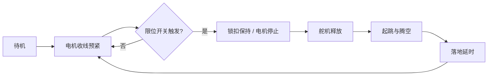

# 袋鼠仿生弹跳机器人完整重设计报告

## 1. 项目定位

本项目设计一种面向机械设计课程作业的袋鼠仿生弹跳机器人。与只做外形仿生不同，本方案以袋鼠跳跃的功能机制为仿生对象：后肢同步蹬伸、肌腱弹性储能、瞬时释放起跳、尾部姿态平衡。

项目目标：

- 形成一个真正可运动的机械机构，而不是静态造型。
- 单侧后肢采用闭链机构，保证输入一个角度即可带动腿部完成蹲伏与伸展。
- 电机不直接承担瞬时起跳功率，而是用于慢速预紧弹性件。
- 用锁止释放机构实现“慢速储能、快速释放”的弹跳模式。
- 具备本科大三课程项目所需的结构图、尺寸、BOM、建模路径和验证方案。

## 2. 总体方案

机器人由机身、左右闭链后肢、弹性肌腱、减速电机、绕线轮、锁扣释放机构、尾杆与控制系统组成。

工作循环：

1. 电机带动绕线轮收线，拉伸弹性件，机器人后肢进入蹲伏状态。
2. 锁扣/棘爪锁住储能位置，电机可停止输出。
3. 微型舵机拨开锁扣，弹性件瞬时回弹。
4. 弹性件驱动闭链后肢快速伸展，足端向后下方推地，机器人起跳。
5. 腾空阶段尾杆提供俯仰惯量，落地后重新预紧。

建议总装示意见：`10_overall_side_mechanism_cn.png`。

## 3. 仿生依据

| 袋鼠运动特征 | 本设计对应结构 | 设计意义 |
|---|---|---|
| 后肢同步跳跃 | 左右腿通过横轴同步释放 | 避免单侧腿先释放导致侧翻 |
| 肌腱储能回弹 | 拉簧/橡皮筋束作为弹性肌腱 | 降低电机瞬时功率需求 |
| 髋、膝、踝协同伸展 | 六杆闭链后肢 | 用 1 个输入实现多关节联动 |
| 尾部辅助平衡 | 可调尾杆与尾端配重 | 改善起跳/落地俯仰稳定性 |
| 着地后再储能 | 电机重新预紧弹性件 | 形成可重复跳跃循环 |

参考袋鼠腿部比例时，可采用“股段较短、小腿/跖足较长”的趋势。本方案中 L3 大腿摇杆 100 mm，L4 小腿 140 mm，足部延伸约 70-90 mm，体现后肢远端较长的弹跳动物形态。

## 4. 机构设计

### 4.1 单侧后肢机构拓扑

单侧后肢为平面六杆闭链机构：

- L0：机架，含固定铰点 H0、H1、H2。
- L1：输入曲柄 H1-A。
- L2：连杆 A-B。
- L3：大腿摇杆 H0-B。
- L4：小腿杆 B-F。
- L5：后摇杆 H2-F。
- 足部：从 F 点向前下方延伸，作为触地执行端。

机构简图见：`11_dof_kinematic_proof_cn.png`。

### 4.2 自由度计算

按平面低副机构计算：

```text
M = 3(n - 1) - 2j
n = 6：机架 + 5 个活动构件
j = 7：转动副数量
M = 3 × (6 - 1) - 2 × 7 = 1
```

结论：单侧后肢是确定运动的一自由度闭链机构。该结论可直接回应“无法构成机构”的问题。

### 4.3 初始尺寸

| 项目 | 数值 |
|---|---:|
| H0-H1 机架孔距 | 100 mm |
| H0-H2 机架孔距 | 134 mm |
| L1 曲柄 H1-A | 40 mm |
| L2 连杆 A-B | 120 mm |
| L3 大腿摇杆 H0-B | 100 mm |
| L4 小腿 B-F | 140 mm |
| L5 后摇杆 H2-F | 180 mm |
| 尾杆长度 | 180-220 mm |
| 尾端配重 | 0-30 g |
| 侧板厚度 | 3-4 mm |
| 左右侧板间距 | 8-12 mm |
| 弹性预紧量 | 20-45 mm |
| 绕线轮半径 | 12-18 mm |

带尺寸图见：`17_dimensioned_mechanism_cn.png`。

## 5. 驱动与释放模块

本项目不建议用电机直接驱动跳跃。原因是跳跃瞬间需要较高功率，小型直流电机直接驱动往往扭矩和响应都不足。

更合理的方案是：

- 减速电机：慢速收线，完成能量输入。
- 绕线轮：将电机旋转转化为弹性件拉伸。
- 弹性肌腱：拉簧或橡皮筋束，储存势能。
- 锁扣/棘爪：保持蹲伏储能状态。
- 舵机：释放锁扣。
- 限位开关：检测预紧到位，避免过拉。

模块图见：`12_motor_preload_latch_module_cn.png`。

## 6. 能量与性能估算

初步估算采用：

```text
m = 0.45 kg
k = 900 N/m
eta = 45%
E = 1/2 kx^2
h = eta E / (mg)
```

| 预紧量 | 弹性势能 | 预估跳高 | 预估跳远 |
|---:|---:|---:|---:|
| 20 mm | 0.18 J | 1.8 cm | 3.4 cm |
| 25 mm | 0.28 J | 2.9 cm | 5.3 cm |
| 30 mm | 0.41 J | 4.1 cm | 7.8 cm |
| 35 mm | 0.55 J | 5.6 cm | 10.6 cm |
| 40 mm | 0.72 J | 7.3 cm | 13.8 cm |
| 45 mm | 0.91 J | 9.3 cm | 17.5 cm |

注意：以上为初设估算，不是实测结果。答辩前建议每个预紧量重复 5 次测试，用均值与标准差替换。图表见：`16_estimated_simulation_results_cn.png`。机构尺寸已经按闭链可装配条件重新校核，建议以 `20_dimensioned_mechanism_verified_cn.png` 和 `verified_body_and_links_import_to_inventor.dxf` 为准。

## 7. 制造方案

推荐材料与工艺：

- 机身侧板：3-4 mm 亚克力板、碳板或 PLA 打印件。
- 连杆：3 mm 亚克力/铝板/PLA 打印件。
- 关节：M3 螺栓 + 垫片 + 尼龙锁紧螺母；条件允许可加 3×6×2.5 mm 小轴承。
- 侧板连接：M3 铜柱或 3D 打印垫柱，长度 8-12 mm。
- 足部：PLA 主体 + 橡胶垫，提高摩擦并缓冲落地。
- 尾杆：碳杆、铝杆或打印杆，尾端用螺母配重。
- 弹性件：橡皮筋束适合快速调试，拉簧适合稳定重复实验。

BOM 见：`BOM_redesigned_kangaroo_robot.csv`。

## 8. 控制逻辑

控制系统可用 Arduino Nano、ESP32 或类似开发板。基本状态机如下：



安全建议：

- 预紧测试从 20 mm 开始，不要直接拉到 45 mm。
- 在机身上设置机械限位，避免曲柄越位。
- 释放舵机动作前，人手不要靠近腿部与弹性件。
- 电机收线端加入限位开关或电流检测，避免烧电机。

## 9. 鲁棒性检测方案

验证不是只看“能不能跳一次”，而是看机构是否稳定、参数是否可调、制造误差是否可接受。

建议检测：

- 输入角 0-90° 手动转动，检查是否卡死或干涉。
- 预紧量 20/30/40 mm 各重复 5 次，测跳高、跳远。
- 尾重 0/15/30 g 对比俯仰稳定性。
- 足垫材料对比打滑距离。
- 孔距误差 ±1 mm 时检查机构是否仍能顺畅运动。
- 连杆承受 5-20 N 拉压力时检查变形。

检测矩阵见：`15_robustness_validation_cn.png`。

## 10. 本方案相对旧方案的改进点

- 从“看起来像袋鼠”改为“运动机理像袋鼠”。
- 明确给出闭链机构拓扑和自由度计算，证明机构成立。
- 加入弹性储能和锁止释放，解决小电机直接跳跃功率不足的问题。
- 加入尾杆配重，用于解释姿态稳定和袋鼠尾部仿生。
- 提供 DXF、BOM、尺寸表和建模指南，可实际制造。
- 提供鲁棒性检测矩阵，能支撑课程答辩中的工程验证。
