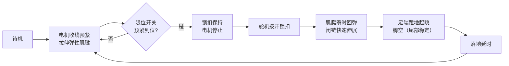

# 袋鼠仿生弹跳机器人 设计任务书 / 设计说明书

> 机械设计课程项目 · 重设计版本
> 单位：__________  专业：__________  班级：__________  姓名：__________  学号：__________  指导教师：__________  日期：__________

---

## 0. 文档说明

本文件是袋鼠仿生弹跳机器人的课程提交材料，同时充当**设计任务书**（规定要做什么、达到什么指标）与**设计说明书**（说明怎么做、为什么这么做）。

本次为**重设计版本**。原方案被评价为“机构设计不足，无法构成机构，没有很好展示袋鼠运动仿生”。重设计的核心思路是：**从“外形像袋鼠”转为“运动机理像袋鼠”**——以确定的一自由度闭链机构、弹性储能、锁止瞬时释放、尾部配重平衡来对应袋鼠的真实跳跃机制，并给出可验证的自由度计算、可制造结构和可信的三维装配。

配套三维模型见：
`solidworks_basic_model/kangaroo_overleap_bioinspired_v1/Kangaroo_Overleap_BioInspired_Assembly.SLDASM`

---

## 1. 项目名称

**袋鼠仿生弹跳机器人设计**（Kangaroo Bio-Inspired Jumping Robot）

英文名：Kangaroo-Inspired Elastic-Energy Jumping Robot
项目代号：kangaroo_overleap_bioinspired_v1

---

## 2. 设计背景与意义

### 2.1 背景

袋鼠是自然界中最高效的跳跃动物之一。其运动有几个突出特征：

- **后肢同步蹬伸**：左右后肢几乎同时发力，避免侧向翻转。
- **肌腱弹性储能**：跟腱在落地压缩时储存能量，蹬伸时释放，使连续跳跃的代谢能耗几乎不随速度上升而增加。
- **多关节协同**：髋、膝、踝在一次蹬伸中按固定规律联动。
- **尾部平衡**：粗大的尾巴在腾空和落地时提供俯仰惯量与配重，稳定姿态，慢速时还作为“第五条腿”形成三点支撑。

### 2.2 工程意义

直接用小型电机驱动跳跃存在瓶颈：起跳瞬间需要很高的功率，而小型直流电机的瞬时扭矩和响应往往不足。袋鼠“慢速储能、瞬时释放”的策略正好规避了这一点。把这一机理工程化，可以：

- 用低功率电机实现高瞬时输出的跳跃；
- 用确定的闭链机构保证“一个输入 → 多关节协调蹬伸”，使机构可分析、可重复；
- 用尾部配重改善起跳与落地姿态稳定性。

### 2.3 对原方案问题的直接回应

| 老师指出的问题 | 本方案的回应 |
|---|---|
| 机构设计不足 | 给出明确的六杆闭链拓扑、构件表与铰点表 |
| 无法构成机构 | 给出自由度计算 M=1，并用圆-圆交点法解出真实可装配位姿 |
| 没有展示袋鼠仿生 | 用弹性储能 + 锁止释放 + 尾部配重对应袋鼠跳跃机理，而非仅做外形 |

---

## 3. 设计目标与技术指标

### 3.1 功能目标

1. 建立一个**确定运动的机构**（一自由度闭链后肢），而非静态造型。
2. 完成**可信的三维建模与装配**（SolidWorks，可打开检查、无明显悬空、部件连接明确）。
3. 完成**可制造结构设计**（材料、连接、紧固、BOM、加工方式）。
4. 完成**电机预紧 / 锁止释放**的储能-释放方案。
5. 完成**尾部仿生稳定**设计（可调尾杆 + 尾端配重）。

### 3.2 量化技术指标（课程演示级）

| 指标 | 目标值 | 说明 |
|---|---|---|
| 整机质量 | ≤ 0.5 kg | 含电池、电机、舵机 |
| 后肢自由度 | 单侧 1 | 闭链，确定运动 |
| 弹性预紧量 | 20–45 mm 可调 | 分级测试 |
| 预估跳高 | 2–9 cm | 初设估算，见第 6 节 |
| 尾端配重 | 0–30 g 可调 | 姿态对比实验用 |
| 控制电压 | 6–12 V | 减速电机 + 舵机 |
| 重复跳跃 | 可循环预紧-释放 | 状态机控制 |

> 注：跳高/跳远为初步能量估算，非实测；答辩前应以实测均值±标准差替换（见第 11 节）。

---

## 4. 仿生分析

### 4.1 袋鼠后肢

袋鼠后肢相对人类有明显的“远端长、近端短”比例：股段相对短，小腿（胫骨）与跖足相对长。长的远端杆件在蹬伸末段提供更大的足端线速度，有利于弹跳。

**本设计对应**：大腿摇杆 L3 = 100 mm，小腿 L4 = 140 mm，足部延伸约 80 mm，体现“远端较长”的弹跳动物形态。

### 4.2 跟腱 / 肌腱弹性储能

袋鼠跟腱在落地相被拉伸储能，在蹬伸相回弹释放，相当于一个并联在关节上的弹性元件。这使得袋鼠在一定速度区间内连续跳跃几乎不额外增加代谢能耗。

**本设计对应**：用拉簧 / 橡皮筋束作为“弹性肌腱”，由电机经绕线轮缓慢拉伸储能，释放时驱动闭链快速伸展。电机只承担**慢速能量输入**，不承担起跳瞬时功率。

### 4.3 尾部平衡作用

袋鼠尾巴质量大、力臂长：腾空相提供俯仰惯量调节身体姿态，落地相缓冲并配重；慢速移动时尾巴着地与两后肢形成稳定的三点支撑。

**本设计对应**：可调尾杆（180–220 mm）+ 尾端配重（0–30 g），向机身后下方伸出，与前下方伸出的足端形成姿态平衡，改善起跳/落地俯仰稳定性。

### 4.4 本项目对应结构小结

| 袋鼠运动特征 | 本设计对应结构 | 设计意义 |
|---|---|---|
| 后肢同步跳跃 | 左右腿经 M3 横轴同步释放 | 避免单侧先释放导致侧翻 |
| 肌腱储能回弹 | 弹性肌腱 + 绕线轮 | 降低电机瞬时功率需求 |
| 髋/膝/踝协同伸展 | 六杆闭链后肢 | 一个输入实现多关节联动 |
| 尾部辅助平衡 | 可调尾杆 + 尾端配重 | 改善俯仰稳定性 |
| 着地后再储能 | 电机重新收线预紧 | 形成可重复跳跃循环 |

---

## 5. 总体方案

机器人由七大部分组成：

1. **机身（机架）**：两块平行侧板，承载所有固定铰点 H0/H1/H2 与尾部铰点 T，以及电机/舵机/锁扣安装位。
2. **后肢闭链机构**：左右各一套平面六杆闭链（详见第 6 节），是运动核心。
3. **弹性肌腱**：拉簧 / 橡皮筋束，储存弹性势能。
4. **电机 + 绕线轮**：减速电机慢速收线，把旋转运动转为肌腱拉伸（能量输入）。
5. **锁扣 + 舵机释放**：锁扣（棘爪）保持蹲伏储能状态；微型舵机拨开锁扣实现瞬时释放。
6. **尾杆 + 配重**：被动可调，提供俯仰稳定与三点支撑。
7. **控制系统**：开发板 + 电机驱动 + 舵机 + 限位/姿态传感器。

### 5.1 工作循环



文字描述：电机带动绕线轮收线 → 弹性件被拉伸、后肢蹲伏 → 锁扣锁住储能位置、电机停转 → 舵机拨开锁扣 → 弹性件瞬时回弹驱动闭链伸展 → 足端向后下方蹬地、机器人起跳 → 腾空阶段尾杆提供俯仰惯量 → 落地后重新预紧，形成循环。

---

## 6. 机构设计

### 6.1 单侧后肢机构拓扑

单侧后肢为**平面六杆闭链机构**：

| 构件 | 名称 | 铰点 | 杆长 |
|---|---|---|---:|
| L0 | 机架 | 含固定铰 H0、H1、H2 | — |
| L1 | 输入曲柄 | H1–A | 40 mm |
| L2 | 连杆 | A–B | 120 mm |
| L3 | 大腿摇杆 | H0–B | 100 mm |
| L4 | 小腿杆 | B–F | 140 mm |
| L5 | 后摇杆 | H2–F | 180 mm |
| — | 足部 | 由 F 向前下延伸 | ≈80 mm |

机架固定孔距：H0–H1 = 100 mm，H0–H2 = 134 mm。
足部为触地执行端，刚接在 L4 末端的 F 点。

### 6.2 自由度计算

按平面低副机构（Grübler 公式）计算：

```text
M = 3(n - 1) - 2·j
n = 6   （机架 L0 + 5 个活动构件 L1~L5）
j = 7   （转动副：H0, H1, H2, A, B, F, 以及闭链中第 7 个低副）
M = 3 × (6 - 1) - 2 × 7 = 15 - 14 = 1
```

**结论：M = 1，单侧后肢是确定运动的一自由度闭链机构。** 即只要给定一个输入（曲柄 H1–A 的转角），整条腿的运动就完全确定。这直接回应了“无法构成机构”的问题。

### 6.3 关键尺寸表

| 项目 | 数值 |
|---|---:|
| H0–H1 机架孔距 | 100 mm |
| H0–H2 机架孔距 | 134 mm |
| L1 曲柄 H1–A | 40 mm |
| L2 连杆 A–B | 120 mm |
| L3 大腿摇杆 H0–B | 100 mm |
| L4 小腿 B–F | 140 mm |
| L5 后摇杆 H2–F | 180 mm |
| 足部延伸 | ≈80 mm |
| 尾杆长度 | 180–220 mm（可调） |
| 尾端配重 | 0–30 g（可调） |
| 侧板厚度 | 3–4 mm |
| 左右侧板间距 | ≈48 mm |
| 弹性预紧量 | 20–45 mm |
| 绕线轮半径 | 12–18 mm |

### 6.4 位姿解算与可装配性验证

本方案没有凭手感摆放连杆，而是**先解算几何再建模**。用圆-圆交点法：给定曲柄角 θ，先求 A，再由 |A–B|=120 与 |H0–B|=100 两圆交点求 B，再由 |B–F|=140 与 |H2–F|=180 两圆交点求 F。

选定曲柄角 **θ = -121°**（蹲伏储能姿态），解得各铰点坐标（单位 mm，机身坐标系，X 向前、Y 向上）：

| 点 | 坐标 (x, y) |
|---|---|
| H0 | (0.000, 0.000) |
| H1 | (-80.000, 60.000) |
| H2 | (120.000, 60.000) |
| A | (-100.602, 25.713) |
| B | (-53.339, -84.587) |
| F | (83.053, -116.167) |
| 足端 | (160.991, -134.213) |

**杆长约束校核**（计算值 vs 目标，误差到机器精度）：

| 约束 | 目标 | 计算值 | 误差 |
|---|---:|---:|---:|
| H1–A (L1) | 40 | 40.000 | 0 |
| A–B (L2) | 120 | 120.000 | <1e-13 |
| H0–B (L3) | 100 | 100.000 | 0 |
| B–F (L4) | 140 | 140.000 | 0 |
| H2–F (L5) | 180 | 180.000 | 0 |

五个杆长约束全部满足，足端落在机身下方约 134 mm，证明该位姿真实可装配、闭链真实闭合。解算脚本：`solidworks_basic_model/kangaroo_overleap_bioinspired_v1/solve_mechanism.py`，结果存于 `mechanism_pose.json`。

### 6.5 足端运动逻辑

随曲柄 H1–A 从蹲伏角向伸展角转动，闭链联动使大腿摇杆 L3 与后摇杆 L5 同时外摆，足端 F 沿一条向后下方的轨迹快速下压、蹬地，从而产生起跳推力。释放时弹性肌腱驱动曲柄快速转过这一区间，把储存的弹性势能转化为足端蹬地冲量。机构干涉检查与运动范围见第 11 节。

---

## 7. 驱动与控制方案

### 7.1 为什么不用电机直接驱动跳跃

起跳瞬间需要很高的功率，小型直流电机的瞬时扭矩与响应都不足。因此采用**慢速储能、瞬时释放**：电机只负责慢速把能量“充”进弹性件，真正的高功率输出由弹性件回弹完成。

### 7.2 驱动链组成

| 模块 | 选型建议 | 作用 |
|---|---|---|
| 减速电机 | 6–12 V 直流减速电机 | 慢速收线，能量输入 |
| 绕线轮 | r = 12–18 mm | 把电机旋转转为肌腱拉伸 |
| 弹性肌腱 | 拉簧 / 橡皮筋束 | 储存弹性势能 |
| 锁扣 / 棘爪 | PLA / 铝 | 保持蹲伏储能状态 |
| 释放舵机 | MG90S / 20 g 舵机 | 拨开锁扣实现瞬时释放 |
| 限位开关 | 微动开关 | 检测预紧到位，防过拉 |

### 7.3 控制系统

- **主控**：ESP32 DevKit（或 Arduino Nano）。
- **电机驱动**：TB6612FNG（小电流）或 BTS7960（大电流）。
- **姿态传感（可选）**：MPU6050 IMU，用于记录起跳/落地俯仰角，支撑尾重对比实验。
- **电源**：2S 锂电 + LM2596 降压，分别供主控逻辑与电机/舵机。

### 7.4 控制流程（状态机）

```text
待机 IDLE
  └─→ 预紧 PRELOAD：电机收线
        └─ 限位触发？ 否→继续收线；是→进入 LOCKED
  └─→ 锁定 LOCKED：锁扣保持，电机停止
        └─→ 释放 RELEASE：舵机拨开锁扣
              └─→ 起跳 JUMP：弹性件回弹，闭链伸展，足端蹬地
                    └─→ 落地延时 LAND_DELAY
                          └─→ 回到 PRELOAD（循环）
```

### 7.5 安全建议

- 预紧从 20 mm 开始，逐级增加，不要一上来拉到 45 mm。
- 机身上设机械硬限位，防止曲柄越位。
- 舵机释放前，人手远离腿部与弹性件。
- 电机收线端加限位开关或电流检测，避免过拉烧电机。

---

## 8. 尾部仿生设计

### 8.1 被动可调尾杆

尾杆为被动件（不主动驱动），通过铰点 T 接在机身后下方，向后下方伸出。长度 180–220 mm 可调，用于改变力臂。材料用碳杆 / 铝杆 / 打印杆。

### 8.2 尾端配重

尾端用螺母叠加实现 0–30 g 可调配重。配重越大、力臂越长，对机身俯仰的惯量与配平作用越强，但也增加整机质量。需要在“稳定性”与“质量”之间折中，由实验确定。

### 8.3 俯仰稳定实验设计

- **变量**：尾端配重 0 g / 15 g / 30 g。
- **测量**：用 IMU 或高速视频记录起跳瞬间与落地瞬间的机身俯仰角峰值。
- **判据**：俯仰角峰值越小、落地后回稳越快越好。
- **输出**：配重-俯仰角曲线，给出推荐配重。
- **预期**：适当配重显著降低起跳后“前倾/后仰”幅度，验证袋鼠尾部平衡仿生的有效性。

---

## 9. 材料与制造方案

### 9.1 推荐材料与工艺

| 部件 | 材料 | 工艺 |
|---|---|---|
| 机身侧板 | 3–4 mm 亚克力 / 碳板 / PLA | 激光切割 / 3D 打印 |
| 连杆 L1–L5 | 3 mm 亚克力 / 铝板 / PLA | 激光切割 / 3D 打印 / CNC |
| 足部 | PLA 主体 + 橡胶垫 | 3D 打印 + 粘贴橡胶 |
| 尾杆 | 碳杆 / 铝杆 / 打印杆 | 标准件 / 打印 |
| 尾端配重 | 钢螺母 | 标准件 |
| 关节销轴 | M3 螺栓 | 标准件 |
| 侧板立柱 | 铜柱 / PLA 垫柱 | 标准件 / 打印 |
| 弹性件 | 拉簧 / 橡皮筋束 | 标准件 |

### 9.2 关节与连接

- 所有铰点用 **M3 螺栓** + 垫片 + 尼龙锁紧螺母；条件允许可加 3×6×2.5 mm 微型轴承。
- 每个运动层之间加垫片，单侧留 ≥0.5 mm 间隙，避免连杆相互摩擦。
- 侧板间用 M3 铜柱 / 打印垫柱撑开，间距约 48 mm。
- 足部加橡胶垫，提高摩擦并缓冲落地。

### 9.3 BOM

详见 `BOM_redesigned_kangaroo_robot.csv`（项目根目录）与三维模型零件清单 `solidworks_basic_model/kangaroo_overleap_bioinspired_v1/parts_list.csv`。

### 9.4 装配最小建议

- 用手转动曲柄确认机构顺畅、无卡死，再装弹性件。
- 加硬限位防止电机过卷弹性件。
- 先低预紧（20 mm）试跳，逐步加大。

---

## 10. 建模方案

### 10.1 SolidWorks 建模内容

最终三维装配位于：
`solidworks_basic_model/kangaroo_overleap_bioinspired_v1/Kangaroo_Overleap_BioInspired_Assembly.SLDASM`

共 16 个唯一原生零件、31 个零件实例，全部为 SolidWorks 实体零件（非网格导入），在第 6.4 节解算的蹲伏储能位姿下装配。

### 10.2 零件清单（建模）

| 零件 | 实例数 | 角色 |
|---|---:|---|
| BodyPlate_3D | 2 | 机身侧板（六边形，含全部固定铰孔与模块安装孔） |
| L1_Crank_40 | 2 | 输入曲柄 H1–A |
| L2_Coupler_120 | 2 | 连杆 A–B |
| L3_Thigh_100 | 2 | 大腿摇杆 H0–B |
| L4_Shank_140 | 2 | 小腿 B–F（带减重孔） |
| L5_Rocker_180 | 2 | 后摇杆 H2–F |
| Foot_80 | 2 | 足部 / 触地端 |
| TailRod_210 | 1 | 尾杆 T–尾端 |
| TailMass | 1 | 尾端配重 |
| ElasticTendon_52 | 1 | 弹性肌腱（绕线轮→A） |
| Drum | 1 | 绕线轮 |
| Motor | 1 | 减速电机（外形包络） |
| Servo | 1 | 释放舵机（外形包络） |
| Latch | 1 | 锁扣 / 棘爪（外形包络） |
| M3_Axle_60 | 7 | 铰点销轴（贯穿左右） |
| Standoff_44 | 4 | 侧板立柱 |

### 10.3 装配关系

- 零件局部原点定义在第一个铰孔，杆体沿 +X 伸到第二个铰孔；装配时按解算坐标平移 + 绕 Z 旋转放置，铰孔自然对齐。
- 左右后肢镜像在 z = ±15 mm，两块侧板在 z = ±24 mm（间距约 48 mm）。
- 7 根 M3 轴穿过 H0/H1/H2/A/B/F/T 各铰点，把左右后肢连成一体；4 根立柱撑开并固定两块侧板。
- 导出整机 STL 的包围盒为 X≈417 × Y≈231 × **Z≈52 mm**，Z 向厚度证明是立体结构而非平板。

### 10.4 参考 Overleap 的结构组织方式

参考开源项目 **Overleap**（MIT 许可，`external_references/overleap`）的“侧板 + 腿 + 足 + 电机/轴/支架”模块化组织方式与装配图组织逻辑。Overleap 是真实可跳的低成本 3D 打印动态跳跃腿，采用准直驱执行器，其 CAD/装配质量可靠，适合作为三维建模与装配的参照。

### 10.5 本项目改型内容

在 Overleap 的结构逻辑之上做袋鼠仿生改型（而非直接复用其带传动腿）：

- 后肢用**一自由度六杆闭链**（Overleap 为准直驱带传动），保留课程要求的机构拓扑；
- 增加**弹性肌腱 + 绕线轮**（电机慢速储能）；
- 增加**舵机 + 锁扣**（蹲伏储能保持与瞬时释放）；
- 增加**袋鼠仿生尾杆 + 尾端配重**（俯仰平衡 / 三点支撑）。

> 改型解释：Overleap 用电机直驱关节实现跳跃，依赖较强的准直驱执行器；本课程项目受限于小型电机，改用“闭链 + 弹性储能 + 锁止释放”来获得高瞬时输出，并增加尾部以贴合袋鼠仿生主题。两者共享“侧板夹持多连杆 + 足端触地”的整体布局逻辑。

### 10.6 模型可信度说明（相对旧模型）

旧装配（`KangarooRobot_TRUE_3D_*` 等）的连杆坐标并未真正满足闭链杆长约束、足端被放到机身上方、部件未共享铰轴，因此看起来像悬空平板，已作为历史版本保留、不作最终交付。新版本**先解算几何再建模**，五个杆长约束满足到机器精度，铰孔对齐、轴/立柱贯穿，且有 52 mm 实测厚度，是可信的三维装配。验证图见模型目录的 `verify_multiview.png`（四视图）与 `final_render.png`（等轴测）。

---

## 11. 验证与测试方案

验证不是只看“能不能跳一次”，而是看机构是否稳定、参数是否可调、制造误差是否可接受。

### 11.1 机构干涉检查

- 在 SolidWorks 中打开装配，用“评估 → 干涉检查”查看部件干涉（占位电机/舵机为外形包络，与连杆的轻微重叠属占位正常，可微调安装孔）。
- 在 H0/H1/H2/A/B/F 添加同心配合后，手动驱动 H1 曲柄角 0–90°，检查是否卡死或干涉。
- 孔距误差 ±1 mm 时复核机构是否仍能顺畅运动。

### 11.2 预紧量–跳高测试

- 预紧量 20 / 30 / 40 mm，各重复 **5 次**，记录跳高、跳远。
- 用均值 ± 标准差表示，替换第 6 节的初设估算值。

### 11.3 尾重–姿态稳定测试

- 尾端配重 0 / 15 / 30 g 对比起跳与落地俯仰角峰值（见第 8.3 节）。

### 11.4 足垫摩擦测试

- 不同足垫材料对比起跳时的打滑距离，选摩擦更好的材料。

### 11.5 重复性测试

- 同一参数下连续多次跳跃，统计跳高离散度，评估机构与控制的重复性。

### 11.6 测试记录表（模板）

| 工况 | 预紧量(mm) | 尾重(g) | 次数 | 跳高均值(cm) | 跳高σ | 俯仰角峰值(°) | 备注 |
|---|---|---|---|---|---|---|---|
| 1 | 20 | 15 | 5 | | | | |
| 2 | 30 | 15 | 5 | | | | |
| 3 | 40 | 15 | 5 | | | | |
| 4 | 30 | 0 | 5 | | | | |
| 5 | 30 | 30 | 5 | | | | |

---

## 12. 预期成果

| 成果 | 文件 / 位置 |
|---|---|
| 任务书 / 设计说明书 | `袋鼠仿生弹跳机器人_设计任务书与说明书.md`（本文件） |
| 完整重设计报告 | `袋鼠仿生弹跳机器人_完整重设计报告.md` |
| SolidWorks 三维装配体 | `solidworks_basic_model/kangaroo_overleap_bioinspired_v1/Kangaroo_Overleap_BioInspired_Assembly.SLDASM` |
| 原生零件模型 | 同目录 `parts/`（16 个 .SLDPRT） |
| 模型说明 | 同目录 `model_readme.md` |
| 零件清单 | 同目录 `parts_list.csv` |
| BOM | `BOM_redesigned_kangaroo_robot.csv` |
| 等轴测渲染 | 同目录 `final_render.png` |
| 四视图验证 | 同目录 `verify_multiview.png` |
| 整机 STL | 同目录 `assembly_export.STL` |
| 机构原理动画 | `solidworks_basic_model/mechanism_motion_animation.gif` / `.webp` |
| 机构原理图（中文） | 项目根目录 `10_*`~`17_*`、`20_*`、`21_*` 系列 PNG/GIF |
| 尺寸表 | `verified_design_dimensions.csv` |
| 测试数据表 | 见第 11.6 节模板（实验后填写） |

---

## 附录 A. 参考资料

- Overleap 开源动态跳跃腿（MIT 许可）：https://github.com/aarondls/overleap
  本地副本：`external_references/overleap`（含 Parts/*.stl、Drawings/Complete_Assembly.pdf、装配步骤图、Arduino 控制代码）。
- 项目仓库：https://github.com/zhijiangong0606-cloud/kangaroo-jumping-robot-redesign
- 更多参考见 `参考项目与资料.md`。

## 附录 B. 设计参数速查

```text
机架：H0(0,0)  H1(-80,60)  H2(120,60)  T(-70,-5)
杆长：L1=40  L2=120  L3=100  L4=140  L5=180  足≈80  尾210
自由度：M = 3(6-1) - 2×7 = 1
预紧：20–45 mm   尾重：0–30 g   侧板间距：≈48 mm
能量估算：m=0.45kg  k=900N/m  η=45%  E=½kx²  h=ηE/(mg)
```
